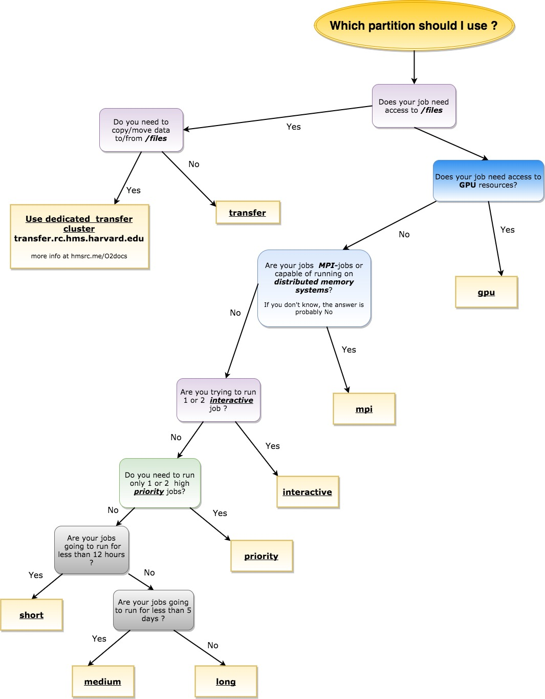

# How to choose a partition in O2

author: Josh Cook  
date: 2018-06-13  

[link to full guide](https://wiki.rc.hms.harvard.edu/display/O2/How+to+choose+a+partition+in+O2)


| Partition   | Job Type            |Priority  | Max cores |Max runtime limit | Min runtime limit | Notes             |
|:------------|:--------------------|:---------|:----------|:-----------------|:------------------|:------------------|
| interactive | interactive         | 14       | 20        | 12 hours         | n/a               | 2 job limit, 20 core limit, 250 GB / job memory limit |
| short       | batch & interactive | 12       | 20        | 12 hours         | n/a               | 20 core limit, 250 GB / job memory limit |
| medium      | batch & interactive | 6        | 20        | 5 days           | 12 hours          | 20 core limit, 250 GB / job memory limit |
| long        | batch & interactive | 4        | 20        | 30 days          | 5 days            | 20 core limit, 250 GB / job memory limit |
| mpi         | batch & interactive | 12       | 640       | 5 days           | n/a               | invite-only (email rchelp)
| priority    | batch & interactive | 14       | 20        | 30 days          | n/a               | limit 2 jobs running at once (like Orchestra priority queue), 20 core per job limit 250 GB / job memory limit |
| transfer    | batch & interactive | n/a      | 4         | 5 days           | n/a               | limit of a 5 concurrently cores per user for transfers between O2 and `/n/files` (see File Transfer ([wiki](https://wiki.rc.hms.harvard.edu/display/O2/File+Transfer) or [my guide](File_Transfer.md)) for more information; invite-only (email rchelp) |
| gpu         | batch & interactive | n/a | 20  | 72 GPU hours | n/a | see the [Using O2 GPU resources](https://wiki.rc.hms.harvard.edu/display/O2/Using+O2+GPU+resources) page for more details |




Any partition can be used to request an interactive session; the interactive partition has a dedicated set of nodes and higher priority.  

Any partition can run single or multi-core jobs. More information is available for multi-core jobs at the dedicated [page](https://wiki.rc.hms.harvard.edu:8443/display/O2/How+To+Submit+Parallel+Jobs+in+O2) or [my guide](How_To_Submit_Parallel_Jobs_in_O2.md). This can also be accomplished using multiple chained `srun` commands:

```bash
#/bin/bash
#SBATCH -c 8
#SBATCH --mem 32G
srun -c 2 --mem=8G COMMAND1 & 
srun -c 4 --mem=8G COMMAND2 & 
srun -c 1 --mem=4G COMMAND3 & 
srun -c 1 --mem 12G COMMAND4 & 
wait
```