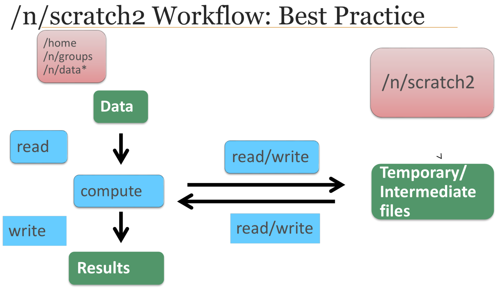

# Using Slurm Basic
author: Josh Cook  
date: 2018-06-08  
**[link to the full guide](https://wiki.rc.hms.harvard.edu/display/O2/Using+Slurm+Basic)**  
Some information was also found in [this](IntroToO2_Spring2018_v2.pdf) document.

### Login
`ssh <ecommonsID>@o2.hms.harvard.edu`  
password: `<ecommons password>`

## Data Storage

### Home

I am allocated 100 GB of storage on my home directory `/home/<ecommonsID>`. This can be checked using the command `quota` when in my home directory.

### Lab Storage

There is (essentially) unlimited storage in the lab directory:

	CookPATH="/n/data2/bidmc/medicine/haigis/Cook"
	
### Temporary storgage

Faster, but temporary, storage can be found at `/n/scratch2/ecommonsID`. Each user is limited to 100 TB. **Note:** Files are automatically deleted after unaccessed for _30 days_. The amount of used space can be found using the command `lfs quota -h /n/scratch2`.

Common uses:

- Keep original files in `/n/data2` or `/home`, write intermediate files to `/n/scratch2`, write final files to `/n/data2` or `/home`.
- Change working directory to `/n/scratch2`, read files from `/n/data2` or `/home`, write temporary files to working directory, write or copy output back to `/n/data2` or `/home`
- Copy input files to `/n/scratch2`, compute against, copy output files to `/n/data2` or `/home`

## Software on O2

### Modules

| Command                          | Purpose                                              |
|:---------------------------------|:-----------------------------------------------------|
| `module load gcc/6.2.0`          | Most software compiled against gcc-6.2.0: load first |
| `module avail`                   | to see software now available                        |
| `module spider`                  | verbose software currently available                 |
| `module load software/version`   | load software                                        |
| `module unload software/version` | unload                                               |
| `module purge`                   | dump all modules                                     |
| `module help <software>`         | displays run info                                    |

### My own software

Users can compile software in their `/home` or `/n/groups` directories.

	mfk8@login01:~$ srun --pty –p interactive –t 0-12:00 --mem 8G bash
	
	mfk8@compute-a:~$ wget http://path/to/binary/mysoftware.tar.gz
	mfk8@compute-a:~$ tar–zxvfmysoftware.tar.gz
	mfk8@compute-a:~$ lsmysoftware/bin

### Programming language

- Python (2.7.12, conda2, 3.6.0) (see [here](https://wiki.rc.hms.harvard.edu/display/O2/Personal+Python+Packages) for using personal Python packages)  
- R (see [here](https://wiki.rc.hms.harvard.edu/display/O2/Personal+R+Packages) for using personal R packages)  
- Perl (see [here](https://wiki.rc.hms.harvard.edu/display/O2/Personal+Perl+Packages) for using personal R packages)  
- MATLAB (see [here](https://wiki.rc.hms.harvard.edu:8443/display/O2/Using+MATLAB) for instructions on using MATLAB in O2)  

## Basic Slurm Commands

|Command                                                   |Meaning                                                                                     |
|:---------------------------------------------------------|:-------------------------------------------------------------------------------------------|
|`sacct -j <jobid>`                                        |Check job accounting data. Running sacct is most useful for completed jobs.                 |
|`sbatch <jobscript>`                                      |Submit a batch job.                                                                         |
|`scancel <jobid>`                                         |Cancel a job. scancel can also be used to kill job arrays or job steps.                     |
|`scontrol show job <jobid>`                               |Look at a running job in detail. For more information about the job, add the -dd parameter. |
|`scontrol hold <jobid>`                                   |Pause a job                                                                                 |
|`scontrol release <jobid>`                                |Release a held job (allow it to run)                                                        |
|`sinfo`                                                   |See node and partition information. Use the -N parameter to see information per node.       |
|`squeue -u <userid>`                                      |View status of your jobs in the queue. Only non-completed jobs will be shown.               |
|`srun --pty -t 0-00:05 -p interactive --mem 8G /bin/bash` |Start an interactive session for five minutes in the interactive queue.                     |

## Submitting Jobs

If you would like to submit a job with a script, use `sbatch`. If you want to start an interactive session, use `srun`.  

`sbatch` is used for **submitting batch jobs**, which means you should write a **script** to use with this command. When invoked, sbatch creates a job allocation before running the script.  

`srun` is used for **starting job steps**. It can be used from within a pre-existing allocation, such as within an sbatch script, or can create a new allocation.

**NOTE:** submission scripts can take command line arguments as well as inheriting environment variables **(your entire current environment is exported with the job when it submits)**.

### The `sbatch` command

**You submit jobs to SLURM using the `sbatch` command, followed by the script you'd like to run.** You will be given a numeric JobID that you can use to monitor your job.  

Must specifiy the **partition** (`-p`) and **runtime limit** (`-t`) with each call.  

Usefull flags for `sbatch`(there are others on the website): 
 
|Flag                 |       Meaning                                                                        |
|:--------------------|:------------------------------------------------------------------------------|
|**`-p short`**       | partition to run the job in                                                   |
|**`-t 0-05:30`**     | runtime limit (0 days, 5 hrs, 30 min)                                         |
|`-c 4`               | number of cores requested per task                                            | 
|`-e <filename>`      | send errors (`stderr`) to `<filename>`                                        |
|`--mail-type=ALL`    | what emails to send (`ALL`, `BEGIN`, `END`, `FAIL`, `TIME_LIMIT`, and others) |
|`--mem=100M`         | reserve 100 MB of memory (other options `G` and `T`)                          |
|`--open-mode=append` | append data to error and output files                                         |
|`-o <filename>`      | write output (`stdout`) to `<filename>`                                       |

Specify all of these options in a script as follows:

	#!/bin/bash
	#SBATCH -p short
	#SBATCH -t 0-05:30
	#SBATCH --mail-type=ALL
	...

### The `srun` command

You can use `srun` to create job steps (simply put `srun` in front of the commands you want to run) within an `sbatch` script, or to start an interactive session. If `srun` is used within an `sbatch` script, it will use the preexisting resource allocation. If `srun` is submitted independent of `sbatch`, you will need to specify resources to be allocated to your job (`srun` has many of the same options as `sbatch`)

#### `srun` in Interactive Sessions

Actually logs into a compute node where you can test commands interactrively, run programs that require user input, or use the GUI of MATLAB or R. 

	[kmk34@login05 ~]$ srun --pty -p interactive --mem 500M -t 0-06:00 /bin/bash
	[kmk34@compute-a-16-68 ~]$

#### `srun` within `sbatch` scripts

**Put `srun` in front of every command in an `sbatch` script**; each denotes a job step that can be monitored.

#### `srun` to run jobs in parallel

To run job steps or multiple commands in *parallel* with resources from the master allocation, use `srun`:

	#/bin/bash
	#SBATCH -c 8
	#SBATCH --mem 32G
	srun -c 2 --mem=8G COMMAND1 & 
	srun -c 4 --mem=8G COMMAND2 & 
	srun -c 1 --mem=4G COMMAND3 & 
	srun -c 1 --mem 12G COMMAND4 & 
	wait

### Job dependencies

`sbatch --dependency=`

- `after:jobid`: asynchronous
- `afterany:jobid`: after exit or done
- `afterok:jobid`: success, exit code 0
- `afternotok:jobid`: failure
- `singleton`: after jobs with same name have terminated
- `--kill-on-invalid-dep=<yes|no>`: kill on unmet dependency (on by default)

### Command line arguments

slurm scripts can take command line arguments Reference as `$1`, `$2`, etc. The script:

	#!/bin/bash
	#SBATCH –p short #SBATCH –t 0-1:00
	python myscript.py $1 $2

The job submission:

	sbatch submit.run 25 output.txt

Runs as:

	python myscript.py 25 output.txt

## Partitions

|Partition   |Specification                                          |
|:-----------|:------------------------------------------------------|
|short       |12 hours                                               |
|medium      |5 days                                                 |
|long        |30 days                                                |
|interactive |2 job limit, 12 hours                                  |
|mpi         |5 days limit                                           |
|priority    |2 job limit, 30 day limit (same as LSF priority queue) |
|transfer    |4 cores max, 5 days limit                              |
|gpu         |see Using O2 GPU resources                             |

## Monitoring Jobs

`squeue`: show all jobs; `-u <ecommons ID>` to see mine  
`scontrol show job <jobid>`: detailed job info; `-dd` shows more info
`sstat`: shows status info for currently running jobs [more info](https://slurm.schedmd.com/sstat.html#lbAE)  
`sacct`: reports accounting info for jobs and steps (running or completed) [more info](https://slurm.schedmd.com/sacct.html#lbAF)  

## Controlling Jobs

|Command                               |Meaning                                |
|:-------------------------------------|:--------------------------------------|
|`scancel <jobid>`                     |cancel a sepcific step or array        |
|`scancel --name <jobname>`            |cancel by name assigned when submitted |
|`scancel -u <ecommons ID>`            |cancel everything                      |
|`scancel -t RUNNING -u <ecommons ID>` |cancel all *running* jobs              |
|`scontrol hold <jobid>`               |pause `<jobid>`                        |
|`scontrol release <jobid>`            |release held job                       |

## Output

### [Troubleshooting](https://wiki.rc.hms.harvard.edu/display/O2/Troubleshooting+Slurm+Jobs)

Use `sacct -j <jobid>` to get information about a job (running or completed). The following code can print a lot of info:

	sacct -j <jobid> --format JobId,NNodes,Partition,NCPUs,State,ReqMem,MaxRSS,Elapsed,CPUTime,TimeLimit,ExitCode,Start,End

**`TIMEOUT` error**: the CPUTime reported will be greater than the `-t` limit you specified in your job.  

**Too much memory**: you will receive an error like: `Job <jobid> exceeded memory limit <memorylimit>, being killed`. For this job, `sacct` will report a larger `MaxRSS` than `ReqMem`, and `CANCELLED` job status. (Rerun the job requesting more memory.)

If contacting Research Computing for help, include the *job ID* and *job report*.

### Job output handeling

specify the names of`stdout` and `stderr` files:

	sbatch -o myjob.out -e myjob.err myjob.sh

include executing node name and job IDs to the file names:

	sbatch -o %N_%j.out -e %N_%j.err myjob.sh

### Running graphical output on 02 and X11

If a program with a GUI uses the X11 system (eg. R, MATLAB), the program can run on an O2 computer and show graphics on my desktop. [Need to have an X11 server running on my desktop, and the SSH connection needs to have X11 forwarding enabled.](https://wiki.med.harvard.edu/Orchestra/UsingX11ApplicationsRemotely)  

Need to connect to O2 with the `-XY` flags:

	ssh -XY <ecommons ID>@o2.hms.harvard.edu

Include the `--x11` flag to `srun` to enable graphics forwarding:

	srun --pty -p interactive -t 0-0:5 --x11 bash

and from within an `sbatch` job submission:

	srun --x11=batch

## Running jobs on multiple cores

(Some programs refer to "core" as "processors," "threads," or "CPUs.")  

Must dictate number of cores for a run:

	#SBATCH -c 8

And then later in the script, a program is run and told it is given that many cores, e.g.:

	tophat -p 8 ...

Note: "on O2, CPU usage is restricted to the cores you request..."

---
### Other documentation

[File Transfer](https://wiki.rc.hms.harvard.edu/display/O2/File+Transfer) ([my notes](/Users/admin/Documents/HMS Research Computing guides/File Transfer.md))  

[Filesystems](https://wiki.rc.hms.harvard.edu/display/O2/Filesystems) ([my notes](/Users/admin/Documents/HMS Research Computing guides/Filesystems.md))  

[Troubleshooting Slurm jobs](https://wiki.rc.hms.harvard.edu/display/O2/Troubleshooting+Slurm+Jobs)  

[How to choose a partition in O2](https://wiki.rc.hms.harvard.edu/display/O2/How+to+choose+a+partition+in+O2)  

[Using O2 GPU resources](https://wiki.rc.hms.harvard.edu/display/O2/Using+O2+GPU+resources)   

[How to submit parallel jobs in O2](https://wiki.rc.hms.harvard.edu:8443/display/O2/How+To+Submit+Parallel+Jobs+in+O2#HowToSubmitParallelJobsinO2-DistributedMemoryParallelization)  

[Using X11 applications romotely](https://wiki.med.harvard.edu/Orchestra/UsingX11ApplicationsRemotely)  

